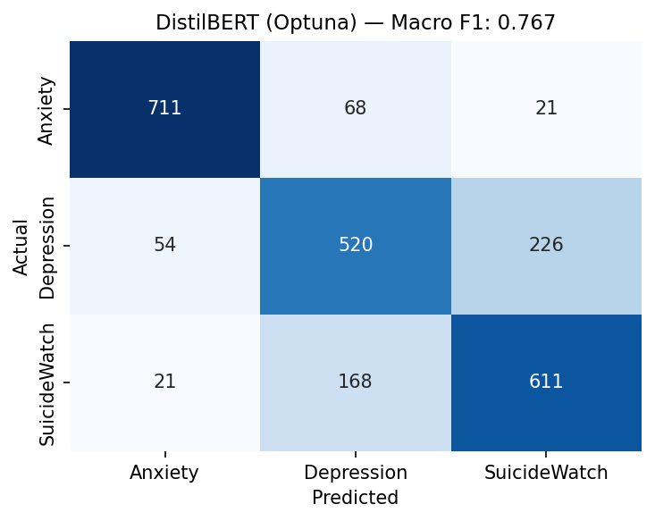
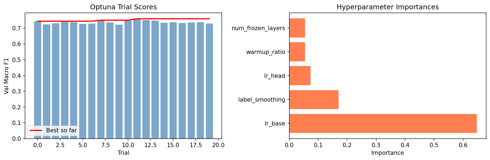

# Social Media and Mental Health - A Machine Learning Analysis of Reddit Discourse

**Course:** CS 6140 — Machine Learning and Pattern Recognition, Northeastern University  
**Authors:** Manu Sharanya Bhadriraju, Ardhra Ann Denny

---

## Overview

Anonymous platforms like Reddit surface raw, unfiltered mental health struggles that people often won't say out loud. Depression and anxiety are among the most prevalent yet underdiagnosed conditions today, and social media text is one of the few places where these signals appear organically at scale.

This project tackles the problem as a supervised multi-class classification task: given a Reddit post, predict which mental health subreddit it belongs to — Anxiety, Depression, or SuicideWatch. We benchmarked six models ranging from Logistic Regression to fine-tuned DistilBERT, with Optuna hyperparameter search on the transformer.

---

## Dataset

We used the [Reddit Mental Health Dataset (RMHD)](https://www.kaggle.com/datasets/entenam/reddit-mental-health-dataset) compiled by Rani et al. (2024). The full dataset has 1.49 million posts across five subreddits from January 2019 to August 2022.

For this project, we worked with a stratified 12,000-post subset across three subreddits:

| Split | Size |
|-------|------|
| Train | 9,600 |
| Test  | 2,400 |

**Labels:** `r/Anxiety`, `r/Depression`, `r/SuicideWatch`

Each post was constructed by concatenating the title and selftext fields. The main challenge we ran into was the semantic overlap between Depression and SuicideWatch — posts from those two communities often use very similar language, which hurt per-class performance across all models.

---

## Project Structure

```
Social-Media-and-Mental-Health-BERT/
│
├── notebooks/
│   ├── preprocessing.ipynb           # text cleaning, tokenization, TF-IDF prep
│   ├── preprocesing_bert.ipynb       # BERT-specific tokenization and encoding
│   ├── dataset.ipynb                 # EDA and dataset exploration
│   ├── test_train.ipynb              # classical model training and evaluation
│   ├── test_train_bert.ipynb         # BERT baseline training
│   ├── training_models.ipynb         # full classical model benchmarking
│   ├── distilbert.ipynb              # DistilBERT fine-tuning (manual tuning)
│   └── distilbert_optuna.ipynb       # DistilBERT + Optuna hyperparameter search
│
├── data/
│   ├── dataset_bert.csv              # full preprocessed dataset
│   ├── train_bert.csv                # training split
│   └── test_bert.csv                 # test split
│
├── results/
│   ├── all_results.csv               # final comparison across models
│   ├── distilbert_results.csv        # DistilBERT-specific metrics
│   ├── confusion_distilbert.png      # confusion matrix — manual DistilBERT
│   ├── confusion_optuna.png          # confusion matrix — Optuna DistilBERT
│   └── optuna_results.png            # Optuna trial scores and hyperparameter importances
│
├── model/
│   ├── config.json                   # model architecture config
│   ├── tokenizer.json                # tokenizer vocabulary
│   └── tokenizer_config.json         # tokenizer settings
│   # note: model.safetensors not included (256 MB — exceeds GitHub limit)
│
├── proposal/
│   └── MLPR_Project.pdf              # original project proposal
│
├── MLPR Final PPT.pptx               # final presentation
├── .gitignore
└── README.md
```

---

## Models

We evaluated six models in order of complexity:

1. **Logistic Regression** — interpretable linear baseline; works well with TF-IDF
2. **Naive Bayes** — fast probabilistic model; suited for sparse bag-of-words
3. **SVM** — strong in high-dimensional text spaces; top classical baseline in prior work
4. **XGBoost** — gradient boosting on TF-IDF features
5. **MLP** — lightweight neural network bridging classical and deep learning
6. **DistilBERT** — fine-tuned transformer with Optuna hyperparameter search; best overall

---

## Results

Per-class breakdown (A = Anxiety, D = Depression, S = SuicideWatch):

| Model | Accuracy | Precision | Recall | F1 Score |
|---|---|---|---|---|
| Logistic Regression | 0.7476 | A: 0.90, D: 0.65, S: 0.69 | A: 0.86, D: 0.67, S: 0.71 | A: 0.88, D: 0.66, S: 0.70 |
| Naive Bayes | 0.7123 | A: 0.84, D: 0.61, S: 0.68 | A: 0.85, D: 0.61, S: 0.67 | A: 0.85, D: 0.61, S: 0.67 |
| SVM | 0.7327 | A: 0.89, D: 0.63, S: 0.67 | A: 0.87, D: 0.64, S: 0.69 | A: 0.88, D: 0.64, S: 0.68 |
| XGBoost | 0.7403 | A: 0.91, D: 0.64, S: 0.68 | A: 0.85, D: 0.66, S: 0.71 | A: 0.88, D: 0.65, S: 0.69 |
| MLP | 0.7153 | A: 0.86, D: 0.63, S: 0.65 | A: 0.86, D: 0.59, S: 0.69 | A: 0.86, D: 0.61, S: 0.67 |
| **DistilBERT (Optuna)** | **0.7675** | **A: 0.90, D: 0.69, S: 0.71** | **A: 0.89, D: 0.65, S: 0.76** | **A: 0.90, D: 0.67, S: 0.74** |

**Confusion matrices:**

<p float="left">
  
  
</p>

**Optuna hyperparameter search:**



---

## How to Run

**Install dependencies:**

```bash
pip install transformers torch scikit-learn pandas numpy matplotlib seaborn optuna xgboost nltk
```

**Run notebooks in this order:**

1. `preprocessing.ipynb` — clean and prepare the raw text
2. `preprocesing_bert.ipynb` — tokenize for BERT
3. `dataset.ipynb` — explore the data
4. `training_models.ipynb` — train and evaluate classical models
5. `distilbert.ipynb` — fine-tune DistilBERT manually
6. `distilbert_optuna.ipynb` — run Optuna search and retrain with best params

**Dataset:** Download from [Kaggle](https://www.kaggle.com/datasets/entenam/reddit-mental-health-dataset) and place the CSV files in the `data/` folder.

**GPU note:** DistilBERT training was run on an NVIDIA RTX 5070 (8.5 GB VRAM). The Optuna search (20 trials × 3 epochs) takes roughly 20–40 minutes on similar hardware.

---

## Key Findings

- DistilBERT with Optuna tuning achieved the best test accuracy (76.75%) and macro F1 (0.767), confirming that contextual embeddings capture nuance that bag-of-words approaches miss.
- Anxiety was the easiest class across all models — consistently hitting F1 around 0.85–0.90. Depression was the hardest, with F1 in the 0.61–0.67 range, largely because of semantic overlap with SuicideWatch posts.
- Among classical models, Logistic Regression performed best (accuracy 74.76%), which is consistent with what prior work on this dataset found.
- Optuna improved test macro F1 by ~1.4 points over manual DistilBERT tuning (0.7673 vs 0.7531).

---

## Future Work

- Explore domain-specific transformers like Mental-BERT or RoBERTa to see if pretraining on mental health text closes the gap on the harder classes.
- Build a real-time classification pipeline using the Reddit API for continuous monitoring.
- Apply contrastive learning to better separate semantically similar classes — particularly Depression and SuicideWatch.

---

## References

1. Rani, et al. (2024). *Reddit Mental Health Dataset (RMHD)*. Kaggle.
2. Low, D. M., et al. (2020). NLP Reveals Vulnerable Mental Health Support Groups and Heightened Health Anxiety on Reddit During COVID-19. *JMIR*, 22(10), e22635.
3. Pahari, S. *Kaggel RMHD 2*. Kaggle Notebook.
4. Fowad, M. *Kaggle Dataset — First Dataset*. Kaggle Notebook.
5. Suryavanshi, V. *PTSD Detection (DS) 2*. Kaggle Notebook.
